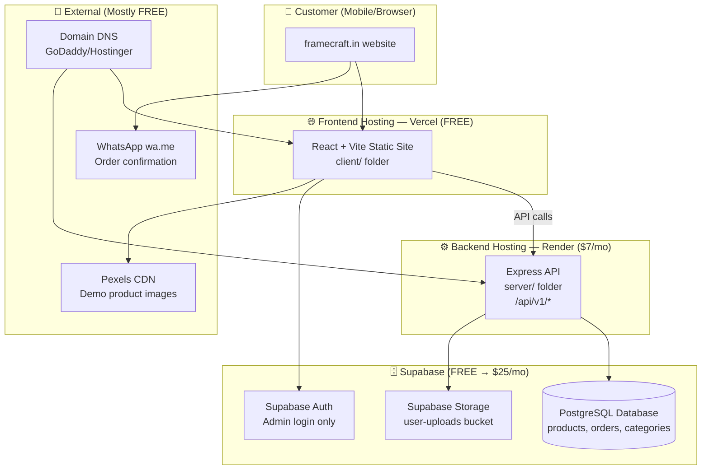

# FrameCraft — Production Deployment Guide (Hinglish)

> **Project:** FrameCraft — Custom Photo Frame E-commerce (WhatsApp-first ordering)  
> **Stack:** React + Vite (frontend) · Express API (backend) · Supabase (database + auth + storage)  
> **Last updated:** June 2026

---

## Table of Contents

1. [Pehle samjho — Tumhara project ka flow kya hai?](#1-pehle-samjho--tumhara-project-ka-flow-kya-hai)
2. [Architecture diagram](#2-architecture-diagram)
3. [Images kahan store hoti hain? (Sabse important)](#3-images-kahan-store-hoti-hain-sabse-important)
4. [Production ke liye kaunse services chahiye?](#4-production-ke-liye-kaunse-services-chahiye)
5. [Minimal cost plan — Kitna paisa lagega?](#5-minimal-cost-plan--kitna-paisa-lagega)
6. [Step-by-step deployment](#6-step-by-step-deployment)
7. [Environment variables (production)](#7-environment-variables-production)
8. [User photo upload — Abhi kya missing hai?](#8-user-photo-upload--abhi-kya-missing-hai)
9. [Apni frame images kaise upload karein?](#9-apni-frame-images-kaise-upload-karein)
10. [WhatsApp, payment aur email](#10-whatsapp-payment-aur-email)
11. [Launch checklist](#11-launch-checklist)
12. [Common problems aur solutions](#12-common-problems-aur-solutions)

---

## 1. Pehle samjho — Tumhara project ka flow kya hai?

Tumhara project **3 alag parts** mein divided hai:

| Part | Folder | Kaam kya karta hai |
|------|--------|-------------------|
| **Frontend (Website)** | `client/` | User ko frames dikhata hai, photo upload, order form, admin panel |
| **Backend (API)** | `server/` | Products, orders, coupons, upload — sab handle karta hai |
| **Database** | `supabase/` | PostgreSQL — products, categories, orders, offers store hota hai |

### Customer order flow (website pe user kya karta hai)

```
Home Page → Category choose → Frame select → Size/Design configure
    → Photo upload (Step 2) → Review (Step 3) → Checkout/Preview
    → Order database mein save → WhatsApp pe message business ko
```

**Important:** Tumhara project abhi **payment gateway use nahi karta** (Razorpay/Stripe nahi hai). Order **WhatsApp** se confirm hota hai — yeh Indian market ke liye smart approach hai aur **extra service cost zero** hai.

### Admin flow

```
/admin/login → Supabase Auth se login → Orders dekho / status update karo
             → Products add/edit karo
```

---

## 2. Architecture diagram

Production mein yeh setup hoga:



---

## 3. Images kahan store hoti hain? (Sabse important)

Yeh section sabse zyada important hai. Tumhare project mein **3 alag types ki images** hain:

### Type A — Product / Category catalog images (Frames ki photos website pe)

Yeh woh images hain jo **shop page, home page, product detail** pe dikhti hain.

| Location | Details |
|----------|---------|
| **Database (primary)** | Supabase `products.images` column — URL array store hota hai |
| **Database (categories)** | `categories.image_url` aur `categories.banner_url` |
| **Seed file** | `supabase/seed.sql` — abhi **Pexels CDN URLs** use ho rahi hain |
| **Frontend fallback** | `client/src/constants/images.ts` aur `frameImages.ts` — agar DB se image na mile toh Pexels se load hoti hai |

**Example seed URL:**
```
https://images.pexels.com/photos/1571468/pexels-photo-1571468.jpeg?auto=compress&cs=tinysrgb&w=900&fit=crop
```

**Production mein kya karna chahiye:**
- Demo ke liye Pexels **theek hai** (free CDN)
- Real business ke liye **apni actual frame photos** Supabase Storage ya Cloudflare R2 pe upload karo
- Database mein apne storage URLs daalo (Pexels ki jagah)

> **Note:** Product **cards** (grid view) abhi `getFrameCardImage()` use karte hain jo slug se Pexels image pick karta hai — API images ignore karta hai. Real photos ke liye yeh bhi update karna padega baad mein.

---

### Type B — User uploaded photos (Customer apni photo upload karta hai frame banane ke liye)

Yeh woh photos hain jo customer **Step 2 — Upload photos** screen pe daalta hai.

| Step | Kya hota hai |
|------|-------------|
| 1 | User photo select karta hai (`ZoominPhotoUploader.tsx`) |
| 2 | Frontend `POST /api/v1/upload` pe bhejta hai |
| 3 | Server file save karta hai aur **public URL** return karta hai |
| 4 | URL order draft mein store hota hai |
| 5 | Order confirm hone pe `orders.uploaded_photo_urls` column mein save hota hai |
| 6 | Admin panel se admin yeh URLs dekh sakta hai |

**⚠️ ABHI CRITICAL ISSUE:**

`server/src/routes/upload.js` abhi **fully implement nahi hai**. Yeh sirf mock response deta hai:

```javascript
// Abhi yeh return hota hai — production ke liye kaam nahi karega
url: `local://${Date.now()}-upload.jpg`
```

Agar upload fail ho, client **browser memory** mein local preview use karta hai (`blob:` URL) — page refresh ke baad **photo gayab ho jayegi**.

**Production mein user photos yahan save honi chahiye:**

```
Supabase Storage → Bucket name: "uploads" (recommended)
Path structure: uploads/orders/{order_id}/{filename}.jpg
```

**Recommended bucket structure:**

| Bucket | Public? | Kya store hoga |
|--------|---------|---------------|
| `product-images` | ✅ Public | Apni frame catalog photos |
| `uploads` | 🔒 Private (signed URLs) | Customer ki personal photos |
| `previews` | 🔒 Private | Frame preview renders |

**Cost:** Supabase Free tier mein **1 GB storage free** hai. Average photo ~2-5 MB. ~200-500 orders tak free tier mein chal jayega.

---

### Type C — Static website assets

| Location | Kya hai |
|----------|---------|
| `client/public/icons.svg` | SVG icons — Vercel pe deploy hote hain |
| Tailwind/CSS | Code mein embedded — alag storage nahi chahiye |

---

### Image flow summary (simple language)

```
┌─────────────────────────────────────────────────────────────┐
│  FRAME CATALOG IMAGES (tumhari shop ki photos)              │
│  Abhi: Pexels URLs in database + constants                  │
│  Production: Supabase Storage "product-images" bucket       │
└─────────────────────────────────────────────────────────────┘

┌─────────────────────────────────────────────────────────────┐
│  USER UPLOADED PHOTOS (customer ki personal photos)         │
│  Abhi: Mock upload (NOT working in production!)             │
│  Production: Supabase Storage "uploads" bucket              │
│  Order mein: orders.uploaded_photo_urls[] column            │
└─────────────────────────────────────────────────────────────┘
```

---

## 4. Production ke liye kaunse services chahiye?

### Zaroori services (Must have)

| # | Service | Recommended Provider | Kyun chahiye |
|---|---------|---------------------|--------------|
| 1 | **Domain name** | Hostinger / GoDaddy / Namecheap | `framecraft.in` jaisa professional URL |
| 2 | **Frontend hosting** | **Vercel** (Free) | React website serve karna |
| 3 | **Backend API hosting** | **Render** Starter ($7/mo) | Express server 24/7 chalna chahiye |
| 4 | **Database + Auth + Storage** | **Supabase** (Free start) | Products, orders, admin login, file uploads |

### Optional services (Baad mein add kar sakte ho)

| Service | Provider | Kab chahiye |
|---------|----------|-------------|
| Email notifications | Resend (free 100/day) ya Gmail SMTP | Order confirm email customer ko |
| Payment gateway | Razorpay | Online payment chahiye toh |
| WhatsApp Business API | Meta / Gupshup | Automated WhatsApp messages (abhi wa.me free hai) |
| CDN for images | Cloudflare R2 | Supabase storage se sasta ho sakta hai scale pe |
| Error monitoring | Sentry (free tier) | Production bugs track karna |
| Analytics | Google Analytics / Plausible | Traffic dekhna |

### Kya purchase NAHI karna (project mein use nahi hota)

- ❌ Separate PostgreSQL server (Supabase already deta hai)
- ❌ AWS EC2 / DigitalOcean VPS (overkill for MVP — Render better)
- ❌ Firebase (tum Supabase use kar rahe ho)
- ❌ Heroku (mehnga, Render sasta hai)
- ❌ WhatsApp Business API (MVP ke liye wa.me kaafi hai)

---

## 5. Minimal cost plan — Kitna paisa lagega?

### Plan A — Absolute Minimum (Testing / Soft Launch)

> Pehle 1-2 mahine test karo, real customers se orders lo

| Service | Cost/month | Cost/year |
|---------|-----------|-----------|
| Domain (.in) | — | ~₹600–999 |
| Vercel (frontend) | **₹0** | ₹0 |
| Render Free (backend) | **₹0** | ₹0 |
| Supabase Free | **₹0** | ₹0 |
| WhatsApp (wa.me) | **₹0** | ₹0 |
| **Total** | **₹0/month** | **~₹800/year** |

**Limitations:**
- Render free tier: 15 min inactive hone pe **server sleep** → pehli request 30-60 sec slow
- Supabase free: 1 week inactive → project **pause** ho sakta hai
- Upload abhi implement nahi — pehle fix karo

---

### Plan B — Recommended Production (Real Business)

> Jab regular orders aane lagen

| Service | Cost/month | Notes |
|---------|-----------|-------|
| Domain | ~₹80/month (~₹999/year) | `.in` domain |
| Vercel Free | ₹0 | Frontend |
| **Render Starter** | **~₹600 ($7)** | Always-on API, no sleep |
| **Supabase Pro** | **~₹2,100 ($25)** | Jab orders badhen, 8GB DB, 100GB storage |
| WhatsApp wa.me | ₹0 | Manual confirmation |
| **Total** | **~₹2,780/month** | Professional setup |

---

### Plan C — Budget Production (Smart middle ground)

> Supabase Free + Render Starter — best value for new business

| Service | Cost/month |
|---------|-----------|
| Domain | ~₹80 |
| Vercel Free | ₹0 |
| Render Starter | ~₹600 |
| Supabase Free | ₹0 |
| **Total** | **~₹680/month (~₹8,160/year)** |

Yeh plan **naye business ke liye best hai** — jab 50+ orders/month ho jayein tab Supabase Pro upgrade karo.

---

## 6. Step-by-step deployment

### STEP 0 — Pehle local pe sab test karo

```bash
# Terminal 1 — Backend
cd server
npm install
# server/.env banao (SUPABASE_URL, SUPABASE_SERVICE_KEY)
npm run dev

# Terminal 2 — Frontend
cd client
npm install
# client/.env banao
npm run dev
```

Health check: `http://localhost:5000/health` → `"dataSource": "supabase"` dikhna chahiye.

---

### STEP 1 — Domain purchase karo

1. [Hostinger.in](https://hostinger.in) ya [GoDaddy.in](https://godaddy.in) pe jao
2. Domain search karo: `framecraft.in`, `yourbrandframes.in`, etc.
3. `.in` domain ~₹600-999/year mein milti hai
4. Purchase karo — DNS settings baad mein configure karenge

---

### STEP 2 — Supabase production project banao

1. [supabase.com](https://supabase.com) → **New Project**
2. Region choose karo: **South Asia (Mumbai)** — India ke users ke liye fastest
3. Strong database password set karo (save karo!)
4. SQL Editor mein yeh files **order mein** run karo:
   - `supabase/schema.sql`
   - `supabase/rls_policies.sql`
   - `supabase/migrations/20250604_order_customer_address.sql`
   - `supabase/seed.sql`

5. Verify karo:
   ```sql
   SELECT COUNT(*) FROM categories;  -- 10
   SELECT COUNT(*) FROM products;    -- 50
   ```

6. **Storage buckets banao** (Dashboard → Storage → New bucket):

   | Bucket name | Public | File size limit |
   |-------------|--------|----------------|
   | `product-images` | ✅ Yes | 5 MB |
   | `uploads` | ❌ No (private) | 12 MB |

7. **Admin user banao:**
   - Authentication → Users → Add user (email + password)
   - SQL Editor:
     ```sql
     INSERT INTO admin_profiles (id, name, role)
     VALUES ('YOUR_USER_UUID', 'Admin Name', 'super_admin');
     ```

8. Keys copy karo (Settings → API):
   - Project URL → `SUPABASE_URL`
   - `anon` key → client ke liye
   - `service_role` key → server ke liye (**secret — kabhi client mein mat daalo**)

---

### STEP 3 — Backend deploy karo (Render)

1. GitHub pe project push karo (public ya private repo)
2. [render.com](https://render.com) → Sign up → New → **Web Service**
3. GitHub repo connect karo
4. Settings:
   - **Root Directory:** `server`
   - **Build Command:** `npm install`
   - **Start Command:** `npm start`
   - **Instance Type:** Starter ($7/mo) — production ke liye
5. Environment Variables add karo:

   ```
   PORT=5000
   CLIENT_URL=https://framecraft.in,https://www.framecraft.in
   SUPABASE_URL=https://xxxxx.supabase.co
   SUPABASE_SERVICE_KEY=eyJ... (service_role key)
   JWT_SECRET=ek-bohot-lamba-random-string-yahan-dalo
   NODE_ENV=production
   ```

6. Deploy karo → URL milega: `https://framecraft-api.onrender.com`

7. Test karo: `https://framecraft-api.onrender.com/health`

---

### STEP 4 — Frontend deploy karo (Vercel)

1. [vercel.com](https://vercel.com) → Sign up with GitHub
2. New Project → Repo select karo
3. Settings:
   - **Root Directory:** `client`
   - **Framework Preset:** Vite
   - **Build Command:** `npm run build`
   - **Output Directory:** `dist`
4. Environment Variables:

   ```
   VITE_API_URL=https://framecraft-api.onrender.com/api/v1
   VITE_SUPABASE_URL=https://xxxxx.supabase.co
   VITE_SUPABASE_ANON_KEY=eyJ... (anon key)
   VITE_BUSINESS_WHATSAPP=919304637399
   VITE_APP_URL=https://framecraft.in
   ```

   > **Important:** `VITE_API_URL` ab `/api/v1` proxy nahi — full Render URL hoga production mein.

5. Deploy → URL milega: `https://framecraft.vercel.app`

---

### STEP 5 — Custom domain connect karo

**Frontend (Vercel):**
1. Vercel Dashboard → Project → Settings → Domains
2. `framecraft.in` add karo
3. Vercel jo DNS records bataye (A record / CNAME) — GoDaddy/Hostinger mein daalo

**Backend (optional subdomain):**
- `api.framecraft.in` → Render service pe point karo
- Phir `VITE_API_URL=https://api.framecraft.in/api/v1` update karo

**DNS example (Hostinger/GoDaddy):**

| Type | Name | Value |
|------|------|-------|
| A | @ | Vercel IP (Vercel batayega) |
| CNAME | www | cname.vercel-dns.com |
| CNAME | api | framecraft-api.onrender.com |

DNS propagate hone mein **15 min – 48 hours** lag sakte hain.

---

### STEP 6 — Supabase CORS / Auth settings

Supabase Dashboard → Authentication → URL Configuration:
- **Site URL:** `https://framecraft.in`
- **Redirect URLs:** `https://framecraft.in/admin/login`

---

### STEP 7 — Upload route implement karo (ZAROORI before launch)

Abhi upload mock hai. Production se pehle Supabase Storage integration karo.

**Server side (`server/src/routes/upload.js`) mein yeh karna hai:**
1. `multer` ya `busboy` add karo multipart file parsing ke liye
2. File ko Supabase Storage `uploads` bucket mein upload karo
3. Signed URL ya public URL return karo
4. Client ko woh URL milega → order mein save hoga

**Bucket policy (Supabase Storage):**
- `uploads` bucket: sirf server (service_role key) upload kar sake
- Admin signed URLs se photos dekh sake

> Jab tak yeh implement nahi hota, customer ki photos **permanently save nahi hongi**.

---

### STEP 8 — Final testing

Production URL pe yeh sab test karo:

- [ ] Home page pe frames dikh rahe hain
- [ ] Category pages load ho rahe hain
- [ ] Product detail → configure → upload → review → checkout flow
- [ ] Photo upload kaam kar raha hai (Supabase Storage mein file dikhe)
- [ ] Order database mein save ho raha hai (`orders` table check karo)
- [ ] WhatsApp message open ho raha hai sahi number pe
- [ ] Admin login kaam kar raha hai `/admin/login`
- [ ] Admin orders page pe naya order dikh raha hai
- [ ] Mobile pe sab theek dikh raha hai

---

## 7. Environment variables (production)

### Server (`server/.env` on Render)

```env
PORT=5000
NODE_ENV=production
CLIENT_URL=https://framecraft.in,https://www.framecraft.in
SUPABASE_URL=https://YOUR_PROJECT.supabase.co
SUPABASE_SERVICE_KEY=your_service_role_key_here
JWT_SECRET=minimum-32-characters-random-string

# Optional — email (abhi code mein use nahi, future ke liye)
SMTP_HOST=smtp.gmail.com
SMTP_PORT=587
SMTP_USER=your@gmail.com
SMTP_PASS=app-specific-password
FROM_EMAIL=noreply@framecraft.in
```

### Client (Vercel Environment Variables)

```env
VITE_API_URL=https://api.framecraft.in/api/v1
VITE_SUPABASE_URL=https://YOUR_PROJECT.supabase.co
VITE_SUPABASE_ANON_KEY=your_anon_key_here
VITE_BUSINESS_WHATSAPP=919304637399
VITE_APP_URL=https://framecraft.in
```

---

## 8. User photo upload — Abhi kya missing hai?

### Current code flow

```
User selects photo
    ↓
ZoominPhotoUploader.tsx → POST /api/v1/upload
    ↓
upload.js → returns mock "local://..." URL  ← PROBLEM
    ↓
On failure → blob: URL (browser only, lost on refresh)  ← PROBLEM
    ↓
Order saved with uploaded_photo_urls in Supabase
    ↓
Admin sees URLs in AdminOrdersPage
```

### Production mein kya hona chahiye

```
User selects photo
    ↓
POST /api/v1/upload (multipart/form-data)
    ↓
Server validates: JPG/PNG/HEIC, max 10MB
    ↓
Upload to Supabase Storage: uploads/{uuid}/{filename}
    ↓
Return: https://xxx.supabase.co/storage/v1/object/sign/uploads/...
    ↓
URL saved in orders.uploaded_photo_urls
    ↓
Admin downloads photo for printing
```

### Storage size estimate

| Orders/month | Avg photos/order | Storage needed |
|-------------|-----------------|----------------|
| 50 | 2 photos × 3MB | ~300 MB/month |
| 200 | 2 photos × 3MB | ~1.2 GB/month |
| 500 | 2 photos × 3MB | ~3 GB/month |

Supabase Free = 1 GB → ~150-200 orders tak. Uske baad Pro ($25) ya purani photos delete/archive karo.

---

## 9. Apni frame images kaise upload karein?

Abhi demo mein Pexels stock photos hain. Real business ke liye apni photos chahiye.

### Option A — Supabase Storage (Recommended, simple)

1. Dashboard → Storage → `product-images` bucket
2. Folder structure:
   ```
   product-images/
   ├── wedding/
   │   ├── love-story-frame-1.jpg
   │   └── love-story-frame-2.jpg
   ├── anniversary/
   └── baby/
   ```
3. Har file ka public URL copy karo
4. Admin panel se product edit karo → `images` field mein URLs daalo
   
   Ya SQL se:
   ```sql
   UPDATE products
   SET images = ARRAY[
     'https://xxx.supabase.co/storage/v1/object/public/product-images/wedding/love-story-1.jpg',
     'https://xxx.supabase.co/storage/v1/object/public/product-images/wedding/love-story-2.jpg'
   ]
   WHERE slug = 'love-story-frame';
   ```

### Option B — Cloudflare R2 (Sasta at scale)

- Storage: $0.015/GB/month (Supabase se sasta bade volume pe)
- Free egress (bandwidth free!)
- Setup thoda complex — MVP ke liye Supabase Storage better

### Option C — Pexels rakhna (Demo/testing only)

- Free, koi upload nahi
- Problem: Generic stock photos, real frames nahi dikhenge
- Customer trust kam ho sakti hai

**Recommendation:** Launch se pehle **minimum 10-15 hero products** ki real photos shoot karo aur Supabase Storage pe upload karo.

---

## 10. WhatsApp, payment aur email

### WhatsApp (Already working ✅)

- Code: `client/src/lib/whatsapp.ts`
- Env: `VITE_BUSINESS_WHATSAPP=919304637399` (91 + 10 digit, no +)
- Flow: Order confirm → WhatsApp app open → pre-filled message business number pe
- **Cost: ₹0** — koi API subscription nahi chahiye MVP ke liye

**Tips:**
- WhatsApp Business app install karo business phone pe
- Quick replies set karo: "Order confirm", "Payment details", "Delivery timeline"
- Catalog bhi WhatsApp Business mein add kar sakte ho

### Payment (Not implemented yet)

Abhi customer WhatsApp pe payment discuss karta hai (UPI/bank transfer).

Agar online payment chahiye:
- **Razorpay** — India ke liye best, 2% transaction fee
- Integration: order confirm se pehle Razorpay checkout
- Cost: No monthly fee, per transaction only

### Email (Optional, not active in code)

- `server/.env.example` mein SMTP settings hain
- `nodemailer` package installed hai par abhi use nahi ho raha
- Future: order confirmation email customer ko
- Free option: Gmail App Password ya **Resend.com** (100 emails/day free)

---

## 11. Launch checklist

### Before going live

- [ ] Supabase production project seeded (50 products)
- [ ] Upload route Supabase Storage se connected
- [ ] Render backend deployed (Starter plan)
- [ ] Vercel frontend deployed
- [ ] Custom domain connected + HTTPS working
- [ ] `VITE_BUSINESS_WHATSAPP` sahi number hai
- [ ] Admin user created + login tested
- [ ] Full order flow tested on mobile
- [ ] At least 10 products ki real photos uploaded
- [ ] Privacy policy page (recommended for photo uploads)
- [ ] Google Search Console submit (SEO)

### After launch (first week)

- [ ] Supabase dashboard monitor — storage usage
- [ ] Render logs check — API errors
- [ ] Test order khud karo weekly
- [ ] WhatsApp response time maintain karo

---

## 12. Common problems aur solutions

| Problem | Reason | Fix |
|---------|--------|-----|
| Website blank, no frames | Supabase connected but not seeded | Run `seed.sql` in SQL Editor |
| API slow first request | Render free tier sleeping | Upgrade to Starter ($7) |
| Photo upload not saving | Upload route is mock | Implement Supabase Storage upload |
| CORS error | Wrong `CLIENT_URL` on server | Add your domain to `CLIENT_URL` env |
| Admin login fails | Wrong anon key or no admin_profiles row | Check Supabase Auth + admin_profiles |
| Images not loading | Pexels blocked / no internet | Use Supabase Storage URLs instead |
| WhatsApp wrong number | Wrong `VITE_BUSINESS_WHATSAPP` | Format: `919876543210` (no + or spaces) |
| Supabase project paused | Free tier 1 week inactive | Upgrade to Pro or open dashboard weekly |
| Order photos lost | blob: URLs used (upload failed) | Fix upload route before accepting orders |

---

## Quick Reference — Services Map

```
framecraft.in          →  Vercel (React frontend)
api.framecraft.in      →  Render (Express backend)
xxx.supabase.co        →  Supabase (DB + Auth + Storage)
wa.me/91XXXXXXXXXX     →  WhatsApp (free, no hosting)
```

---

## Recommended path for YOU (step order)

```
Week 1:  Domain buy + Supabase setup + seed data
Week 2:  Upload route fix (Supabase Storage) + real product photos
Week 3:  Render backend deploy + Vercel frontend deploy
Week 4:  Custom domain + full testing + soft launch
Month 2: Monitor orders → upgrade Supabase Pro if needed
Month 3: Add Razorpay if online payment chahiye
```

---

## Helpful links

| Resource | URL |
|----------|-----|
| Supabase Dashboard | https://supabase.com/dashboard |
| Supabase Storage Docs | https://supabase.com/docs/guides/storage |
| Vercel Deploy Guide | https://vercel.com/docs |
| Render Node.js Deploy | https://render.com/docs/deploy-node-express-app |
| Project Supabase Setup | [supabase/SUPABASE_SETUP.md](../supabase/SUPABASE_SETUP.md) |
| Project README | [README.md](../README.md) |

---

*Yeh guide tumhare FrameCraft project ke actual code aur architecture ke basis pe likhi gayi hai. Koi specific step pe help chahiye (jaise upload route implement karna) toh bolo — woh alag se kar sakte hain.*
